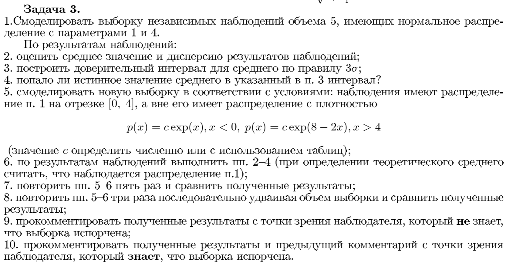

```{r setup, include=FALSE}
knitr::opts_chunk$set(echo = TRUE)
```




Будем использовать $$\overline{X} = \frac{\sum_{i=1} ^ n X_i}{n}$$ для оценки среднего и $$ s^2 = \frac{1}{n-1} \sum_{i=1} ^ n (X_i - \overline{X})$$ для оценки дисперсии.

```{r class.source = 'fold-hide'}
get_est = function(sample) {
  est = c( mean(sample), var(sample))
  names(est) = c("Mean", "Variance")
  est
}
get.99ci = function(sample) {
  est = get_est(sample)
  est_sd = sqrt(est[2] / length(sample))
  mean_conf_interval_99 = c(est[1] - 3*est_sd, est[1] + 3*est_sd) 
  names(mean_conf_interval_99) = c("Lower bound", "Upper bound")
  mean_conf_interval_99
}

```


Берем выборку размером 5 с параметрами $\mu=1$ и $\sigma=2$.

```{r}
set.seed(2023)
n=5
mean=1
sd=2
sample = rnorm(n, mean = mean, sd=sd)
est = get_est(sample)
est
```

Берем $3\sigma$ доверительный интервал

```{r}
get.99ci(sample)
```

Истинное значение попало в интервал.

Теперь утяжеляем хвосты экспоненциальным распределением.

```{r, class.source = 'fold-hide'}
sample_from_density = function(n, pdf_f, approx=1000, ...) {
  x = seq(-10, 10, length.out = approx)
  y = sapply(x, pdf_f, ...)

  random.points <- approx(
    cumsum(y)/sum(y),
    x,
    runif(n)
  )$y
  random.points
}
rlongtailed_normal = function(sd=1, mean=0, c) {
  found
}

dlongtailed_normal = function(x, c, sd=1, mean=0, normal_range=c(0, 4)) {
  if (x >= normal_range[1] & x <= normal_range[2]) {
    return(dnorm(x, mean=mean, sd=sd))
  } else { 
    if (x < 0) {
      return(c * exp(x))
    } else {
      return(c * exp(8 - 2*x))
    }
  }
}

integrate = function(fn, x_range=seq(-10, 10, length.out=100), ...) {
  lambda = abs(abs(x_range[2]) - abs(x_range[1]))
  res = 0
  for (x in x_range) {
    res = res + fn(x, ...) * (lambda)
  }
  res
}

estimate_c = function(sd, mean, tol=0.01) {
  grid = seq(-100, 100, length.out=10000)
  
  for (c in grid) {
    total_proba = integrate(fn=dlongtailed_normal, sd=sd, mean=mean, c=c)
    #
    #for (x in x_range) {
    #  total_proba = total_proba + dlongtailed_normal(x, sd=sd, mean=mean, c=c) * (1 / length(x_range))
    #}
    if (abs(total_proba - 1) < tol) {
      return(c)
    }
  }
}


#c_right_continuous = dnorm(4, mean=mean, sd=sd)
#plot(
#  x_range, 
#  lapply(x_range, dlongtailed_normal, c=c_right_continuous, mean=mean, sd=sd),
#  ylab = "f(x)",
#  xlab = "x",
#  xlim = c(-7, 7)
#)

#hist(sample_from_density(100, pdf_f = dnorm, mean = 1))
# hist(
#   sample_from_density(
#     1000,
#     dlongtailed_normal, 
#     c=c_est,
#     mean=mean,
#     sd=sd
#   ),
#   xlab = "x", ylab = "empirical density",
# )
# integrate(
#   dnorm, 
#   x_range=seq(0, 4, length.out=1000),     
#   #c=c_est,
#   mean=mean,
#   sd=sd
# )
# integrate(
#   dlongtailed_normal,
#   x_range=seq(-10, 10, length.out=1000),
#   mean=mean,
#   sd=sd,
#   c=c_est
# )
```


```{r, fig.width=12, fig.height=5}
par(mfrow=c(1, 2))
c_est = estimate_c(sd=sd, mean=mean)

x_range = seq(-10, 10, length.out = 300)
plot(
  x_range,
  lapply(x_range, dnorm, mean=mean, sd=sd),
  type='l',
  xlab = "x", ylab = "f(x)",
  sub="Исходная плотность"
)
plot( 
  x_range, 
  lapply(x_range, dlongtailed_normal, c=c_est, mean=mean, sd=sd), 
  type='l',
  xlab = "x", ylab = "f(x)",
  sub=paste("Плотность, где c выбран так, чтобы интегрировалось к 1 (c = ", round(c_est, 2), ")")
)
```


Настоящее среднее такого распределения.

```{r}
longtailed_mean = mean(sample_from_density(
  100000,
  dlongtailed_normal, 
  c=c_est,
  mean=mean,
  sd=sd
))
longtailed_mean
```

```{r, class.source = 'fold-hide'}
run_samples = function(n_samples, density, sample_size=5, ...) {
  ci_matrix = matrix(, ncol=2, nrow=0)
  est_matrix = matrix(, ncol=2, nrow=0)
  for (i in 1:n_samples) {
    longtailed_sample = sample_from_density(
      n=sample_size,
      pdf_f=density, 
      approx=1000,
      ...
    )
    ci_matrix = rbind(ci_matrix, get.99ci(longtailed_sample))
    est_matrix = rbind(est_matrix, get_est(longtailed_sample))
  }
  list("ci_matrix" = ci_matrix, "est_matrix" = est_matrix)
}
```

Повторяем пп.2-4 для нового распределения

```{r}
set.seed(2023)
run_samples(
  n_samples=1, 
  sample_size=5, 
  density=dlongtailed_normal, 
  c=c_est, mean=mean, sd=sd
)
```

Повторяем операцию $$n=5$$ раз.

```{r}
set.seed(2023)
run_samples(
  n_samples=5,
  sample_size=5, 
  density=dlongtailed_normal, 
  c=c_est, mean=mean, sd=sd
)
```


```{r, class.source="hide"}
# set.seed(2023)
# for (n_samples in c(5, 10, 20, 30, 40, 50, 100)) {
#   #print(run_samples(n_samples))
#   print(paste("Результаты для n=", n_samples))
#   run_samples(
#     n_samples=100,
#     sample_size=n_samples, 
#     density=dlongtailed_normal, 
#     c=c_est, mean=mean, sd=sd
#   )$ci_matrix
#   
# }
```

Повторяем операцию 3 раза, с объемами выборок $5, 10, 20$.
Во всех случаях $\mu=1$ попало в интервал даже в выборке из испорченного распределения.

При переходе от $n=5$ к $n=10$, а также от $n=20$ к $n=30$ интервалы оказались невложенными, а длинна увеличилась

```{r, class.source = 'fold-hide'}
set.seed(2023)
for (n_samples in c(5, 10, 20, 30, 40, 50, 100)) {
  #print(run_samples(n_samples))
  print(paste("Результаты для n=", n_samples))
  res = (run_samples(
    n_samples=1,
    sample_size=n_samples, 
    density=dnorm, 
    mean=mean, sd=sd
  ))
  res$ci_length = res$ci_matrix[2] - res$ci_matrix[1]
  print(res)
}
```

```{r}

```


В математическом ожидании интервалы сужаются, то есть $E[ 6\hat{\sigma_{\overline{X}}} ] (\text{длина 3-сигма интервала}) \xrightarrow[n \xrightarrow{} \infty]{} 0$. Вот что будет, если брать усредненный доверительный интервал для тех же самых размеров выборки:

1. Для каждого $n=5,10,20,30$
2. Берем 100 выборок размера $n$
3. Для каждой выборки строим доверительный 3-сигма интервал
4. Усредняем полученные 100 левых и правых границ интервалов соответственно.

Таким образом получается оценка математического ожидания левой ($\text{lower.bound}$) и правой границ ($\text{upper.bound}$) интервала, и, как можно видеть, интервалы получаются вложенными, а длина интервалов ($\text{ci.length}$) действительно уменьшается.

```{r,  class.source = 'fold-hide'}
set.seed(2023)
for (n_samples in c(5, 10, 20, 30, 40, 50, 100)) {
  #print(run_samples(n_samples))
  print(paste("Результаты для n=", n_samples))
  ci_matrix = run_samples(
    n_samples=100,
    sample_size=n_samples, 
    density=dlongtailed_normal, 
    c=c_est, mean=mean, sd=sd
  )$ci_matrix
  lower.bound = mean(ci_matrix[, 1])
  upper.bound = mean(ci_matrix[, 2])
  ci_length = upper.bound - lower.bound
  
  res = c(lower.bound, upper.bound, ci_length) 
  names(res) = c("lower.bound", "upper.bound", "ci.length")
  print(res)
}
```

Сравнение распределений левой границы доверительного интервала для испорченного распределения при разных $n$.

```{r,  class.source = 'fold-hide'}
set.seed(2023)
f_range = seq(-5, 5, length.out=50)

colors = c("blue", "red", "green", "pink", "orange")
col_i = 1

for (sample_size in c(5, 10, 20, 30)) {
  #print(run_samples(n_samples))
  lower_ci = run_samples(
    n_samples=300,
    sample_size=sample_size,
    density=dlongtailed_normal,
    c=c_est, mean=mean, sd=sd
  )$ci_matrix[, 1]

  if (col_i == 1) {
    plot(density(lower_ci), col=colors[col_i])
  } else {
    lines(density(lower_ci), col=colors[col_i])
  }
  col_i = col_i + 1
  
}

legend(x="topleft", legend=c("n=5", "n=10", "n=20", "n=30"), fill=colors)
```

Сравнение распределений длин доверительного интервала для испорченного распределения при разных $n$.

```{r,  class.source = 'fold-hide'}
set.seed(2023)
f_range = seq(-5, 5, length.out=50)

colors = c("blue", "red", "green", "pink", "orange")
col_i = 1

for (sample_size in c(5, 10, 20, 30)) {
  #print(run_samples(n_samples))
  ci = run_samples(
    n_samples=300,
    sample_size=sample_size,
    density=dlongtailed_normal,
    c=c_est, mean=mean, sd=sd
  )
  length = ci$ci_matrix[, 2] - ci$ci_matrix[, 1]

  if (col_i == 1) {
    plot(density(length), col=colors[col_i])
  } else {
    lines(density(length), col=colors[col_i])
  }
  col_i = col_i + 1
  
}

legend(x="topleft", legend=c("n=5", "n=10", "n=20", "n=30"), fill=colors)
```

Колебания длины интервала при маленьких выборках обусловлены высокой дисперсией оценки (которая стремится к нулю при $n \xrightarrow{} \infty$).

```{r, class.source="hide"}
# sample_size = 100
# c = 0
# samples = run_samples(
#     n_samples=1000,
#     sample_size=sample_size,
#     density=dnorm,
#     mean=mean, sd=sd
# )$ci_matrix
# 
# 
# for (i in 1:1000) {
#   if ((samples[i,][2] > 1) && (samples[i][1] < 1)) {
#     c = c + 1
#   }
# }
# c
```

Поподробнее разберемся, когда $\mu=1$ будте попадать в доверительный интервал из испорченного распределения.

Повторим построение доверительного интервала из испорченного распределения для размеров выборки $n=2,..,100$ и выведем все случаи, когда $\mu=1$ не попало в доверительный интервал.

```{r}
set.seed(2023)
times = c()

for (sample_size in seq(2, 100)) {
  #print(run_samples(n_samples))
  ci = run_samples(
    n_samples=1,
    sample_size=sample_size,
    density=dlongtailed_normal,
    c=c_est, mean=mean, sd=sd
  )$ci_matrix
  if ((ci[1, 2] > 1) && (ci[1, 1] < 1)) {
  } else {
    times = append(times, sample_size)
  }
}
times
```

Оценим мат ожидание попадания $\mu=1$ в интервал при разных $n$. С увелечением размера выборки для испорченного распределения, растет вероятность непопадания $\mu=1$ в доверительный интервал

```{r, class.source="fold-hide"}
set.seed(2023)
probas = c()

for (sample_size in seq(2, 100)) {
  #print(run_samples(n_samples))
  ci = run_samples(
    n_samples=100,
    sample_size=sample_size,
    density=dlongtailed_normal,
    c=c_est, mean=mean, sd=sd
  )$ci_matrix
  times_for_sample_size = 0
  for (i in seq(1, 100)) {
    if ((ci[i, 2] > 1) && (ci[i, 1] < 1)) {
    } else {
      times_for_sample_size = times_for_sample_size + 1
    }
  }
  probas = append(probas, times_for_sample_size / 100)
}

probas_normal = c()

for (sample_size in seq(2, 100)) {
  #print(run_samples(n_samples))
  ci = run_samples(
    n_samples=100,
    sample_size=sample_size,
    density=dnorm,
    mean=mean, sd=sd
  )$ci_matrix
  times_for_sample_size = 0
  for (i in seq(1, 100)) {
    if ((ci[i, 2] > 1) && (ci[i, 1] < 1)) {
    } else {
      times_for_sample_size = times_for_sample_size + 1
    }
  }
  probas_normal = append(probas_normal, times_for_sample_size / 100)
}
```

```{r}
plot(seq(2,100), probas, type='l', sub = "Оценка вероятность попадания mu=1 в 3-сигма доверительный интервал", xlab="n")
lines(seq(2,100), probas_normal, type='l', col="blue")

legend(1, 95, legend=c("Испореченное распределение", "Нормальное распределение"),
       col=c("red", "blue"), lty=1:2, cex=0.8)
```


```{r, class.source="hide"}
# set.seed(2023)
# sample = rnorm(100)
# print(get.99ci(sample[seq(1,15)]))
# print(get.99ci(sample[seq(1,20)]))
# get.99ci(sample[seq(1,30)])
# get.99ci(sample[seq(1,100)])
```


```{r, class.source="hide"}
# С ростом количества наблюдений интервал в среднем сужается
# data = data.frame(matrix(ncol=3, nrow=0))
# colnames(data) = c("sample_size", "ci", "mean")
data = data.frame(sample_size=c(0), ci=c(0), mean=c(0))
# rbind(data, c(1,1,1))
for (sample_size in c(5, 10, 20, 30, 50, 100)) {
  ci_matrix = run_samples(
    n_samples=300,
    sample_size=sample_size,
    density=dnorm, 
    mean=mean, sd=sd
  )$ci_matrix
  interval_lengths = ci_matrix[, 2] - ci_matrix[, 1]
  interval_means = (ci_matrix[, 2] + ci_matrix[, 1]) / 2
  # da
}
```


Сравнение эмпирических распределений большой выборки

```{r, fig.width=12}
par(mfrow = c(1, 2))

set.seed(2023)
longtailed.sample = sample_from_density(
  1000,
  dlongtailed_normal,
  sd=sd, mean=mean, c=c_est
)

normal.sample = sample_from_density(
    1000,
    dnorm,
    mean=mean, sd=sd
  )
hist(normal.sample, breaks = 50)
hist(longtailed.sample, breaks = 50)
```


```{r, fig.width=12, fig.height=7, class.source = 'hide'}
#Сравнение эмпирических распределений статистик
par(mfrow = c(2, 2))

set.seed(2023)
longtailed.samples = run_samples(
  n_samples=1000,
  sample_size=30,
  density=dlongtailed_normal, 
  c=c_est, mean=mean, sd=sd
)
longtailed.means = longtailed.samples$est_matrix[, 1]
longtailed.variances = longtailed.samples$est_matrix[, 2]

samples = run_samples(
  n_samples=1000,
  sample_size=30,
  density=dnorm, 
  mean=mean, sd=sd
)
means = samples$est_matrix[, 1]
variances = samples$est_matrix[, 2]
#hist(longtailed.means)
#hist(longtailed.variances)
#hist(means)
#hist(variances)
```

Наблюдатель, который не знает, что выборка испорчена может получить неэффективные оценки свойств распределения.

Наблюдатель который знает, что выборка испорчена, может использовать робастные оценки.

```{r, fig.width= 12, class.source="hide"}
library(VGAM)
par(mfrow=c(1,2))
#hist(rlaplace(1000))
#hist(rnorm(1000))

```

